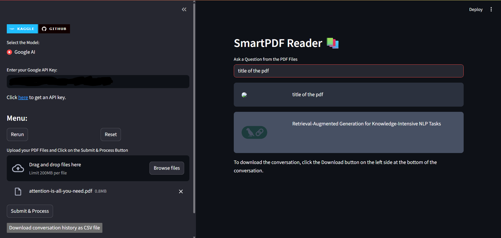

# SmartPDF Reader

SmartPDF Reader is an AI-powered chatbot that enables you to chat with your PDF documents. It uses a Retrieval-Augmented Generation (RAG) architecture powered by Google Gemini for intelligent, contextual answers based on your uploaded PDFs — resumes, reports, or academic papers.

## Motivation

Reading lengthy PDFs manually is slow and inefficient — especially when you're looking for specific information. SmartPDF Reader transforms PDFs into interactive knowledge bases using a chat interface powered by modern language models and RAG architecture.

## 🤖 What is RAG?

**Retrieval-Augmented Generation (RAG)** combines:

- **Retrieval**: Pulling relevant chunks from your PDFs using semantic search via FAISS and Google embeddings.
- **Generation**: Feeding that retrieved context into a language model (Google Gemini) to generate an accurate, grounded response.

This enables high-quality, contextual answers that are anchored in your documents.

## ⚙️ How It Works (RAG Architecture)

```
flowchart 
    Upload[📄 User uploads PDFs] --> Extract[🔍 Text extracted using PyPDF2]
    Extract --> Split[ Text split into chunks (LangChain Splitter)]
    Split --> Embed[🔡 Chunks embedded using Gemini Embeddings]
    Embed --> Store[ Stored in FAISS Vector DB]
    Question[❓ User asks a question] --> Search[🔎 FAISS similarity search]
    Search --> Retrieve[📚 Retrieve top relevant chunks]
    Retrieve --> Generate[ Gemini LLM processes context + question]
    Generate --> Answer[ Final answer returned to Streamlit UI]
```

## 📁 Project Structure

```
SmartPDF-Reader/
│
├── assets/                  # Screenshots, images
├── faiss_index/             # Vector store folder (generated)
├── .gitignore
├── app.py                  # Main Streamlit UI with RAG logic
├── langchain_rag_chatbot   # Alternate file for RAG logic
├── rag_pipeline            # Extra reference scripts
├── rag_pipelines
├── README.md               # You're reading it!
└── requirements.txt        # All Python dependencies
```

## 🖥️ Technologies Used

| Component      | Tool/Library                          |
| -------------- | ------------------------------------- |
| Frontend       | Streamlit                             |
| PDF Parsing    | PyPDF2                                |
| Text Splitting | LangChain                             |
| Embedding      | Google Generative AI Embeddings       |
| Vector Store   | FAISS                                 |
| Language Model | Gemini (gemini-1.5-flash)             |
| RAG Backbone   | LangChain RAG Chain (`load_qa_chain`) |
| UI Styling     | Streamlit + Custom HTML/CSS           |

## 🚀 Installation & Setup

### Prerequisites

- Python 3.8 to 3.11
- A Google Generative AI key

### 🔧 Setup

```bash
git clone https://github.com/yourusername/SmartPDF-Reader.git
cd SmartPDF-Reader

python -m venv venv
source venv/bin/activate  # or venv\Scripts\activate on Windows

pip install -r requirements.txt
```

Create a `.env` file in the root folder:

```bash
GEMINI_API_KEY=your_google_key_here
```

### ▶️ Run the App

```bash
streamlit run src/streamlitMain.py
```

## 📷 Screenshots

> 

## 🔥 Features

- Chat with multiple PDFs
- Backed by RAG architecture (retrieval + generation)
- Powered by Google Gemini embeddings + FAISS
- Download chat as CSV
- Beautiful dark-themed UI

## 🛠️ Future Improvements

- Add local/offline LLM support via Ollama
- Summarization feature
- Multi-language support
- Chat export as PDF

## 👩‍💻 Developed By

**Shafia Saba**

- 🌐 [GitHub](https://github.com/saba6309)
- 🌐 [Gitlab](https://code.swecha.org/shafiasaba)
- 📧 Email: shafiasaba2004@email.com
